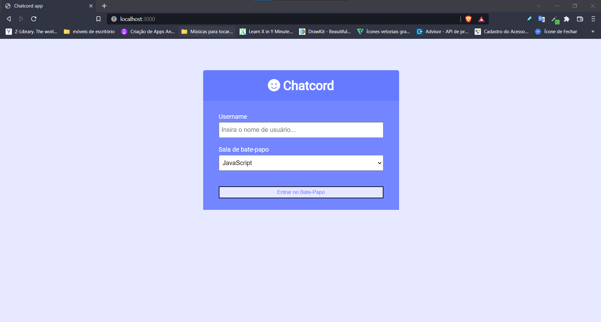
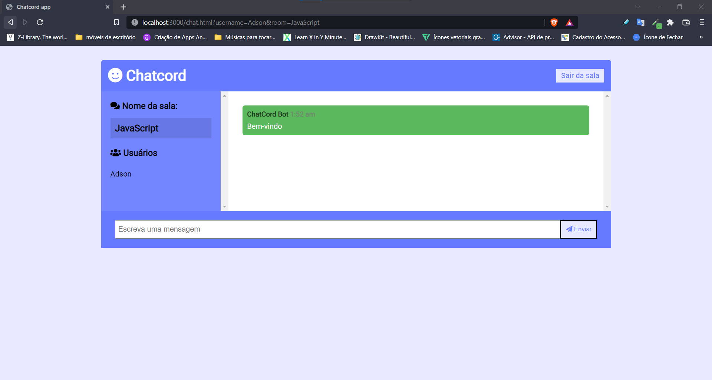
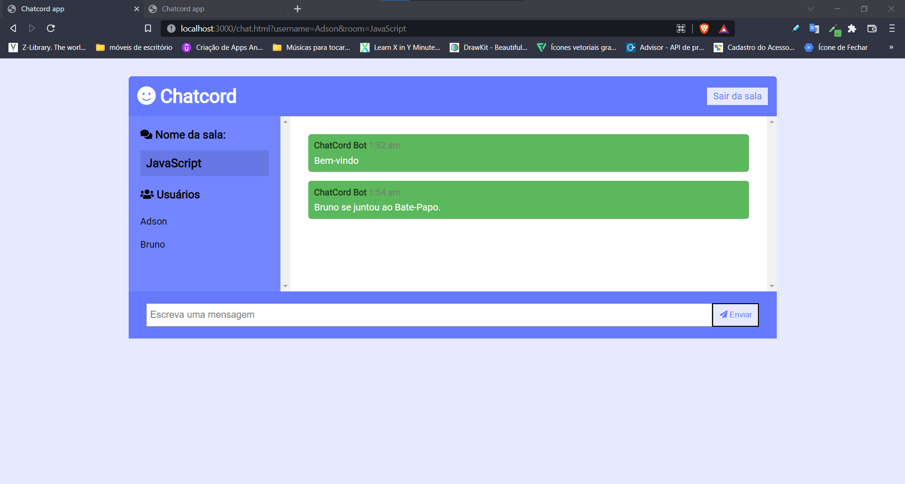

# Rede de Computadores - Socket IO

Projeto da disciplina *Redes de Computadores* do curso de *Ciência da Computação - UFAL - Campus Arapiraca*

* Professor: Thiago
* Aluno: Adson Bruno de Souza Correia

### Requisitos
> Desenvolver uma aplicação utilizando socket com a utilização da arquitetura REST

### Aplicação: Chat em tempo real 

<p align="center">
    
</p>

<p align="center">
    
</p>

<p align="center">
    
</p>

### Funcionalidades
<ul>
<li>Escolher sala de bate-papo</li>
<li>Entrar com nome de usuário</li>
<li>Mostrar quem entrou e quem saiu da sala</li>
<li>Mostrar quais usuários estão na sala</li>
</ul>

### Instruções para executar este projeto

Node.JS >= 16.16.0 e npm >= 8.12.1

#### Executando projeto

Antes de inicializar o projeto é preciso instalar os pacotes ncessário para que se tenha o correto funcionamento do mesmo.

```console
npm install
```

#### Execução do frontend

Dentro da pasta principal, vamos digitar os seguintes comandos:

```console
npm run start
```

Em seguida, na barra de pesquisa do navegador digite: `http://localhost:3000/`